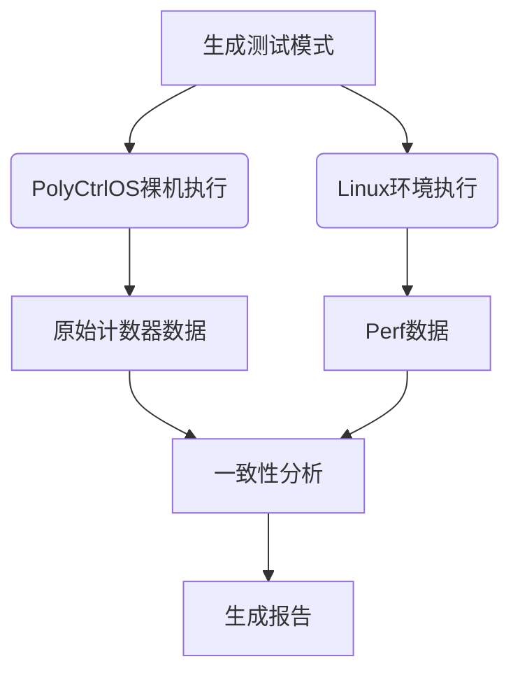

## 裸机

在PolyCtrlOS裸机环境和Linux/EulixOS环境下实现RISC-V IOMMU HPM和Nested测试）的实施方案设计：

---

### **一、硬件性能监控（HPM）实现方案**

#### **1. PolyCtrlOS裸机实现**
**核心步骤**：

1. **计数器寄存器访问**：
   ```asm
   # 示例：读取TLB缺失计数器
   csrr a0, iommu_tlb_miss_counter  # 伪指令，实际寄存器地址参考SPEC
   sw a0, 0(s0)  # 存储到内存
   ```

2. **事件触发设计**：
   
   ```c
   // 在C代码中嵌入汇编触发DMA
   void trigger_dma() {
     asm volatile (
       "li t0, DEVICE_BASE\n"
       "sw a0, 0(t0)\n"  // 启动设备DMA
       ::: "t0"
     );
   }
   ```
   
3. **监控框架**：
   
   ```c
   struct iommu_hpm_event {
     uint32_t event_id;
     uint64_t count;
   };
   
   void monitor_events(struct iommu_hpm_event *events, int num) {
     for (int i = 0; i < num; i++) {
       events[i].count = read_counter(events[i].event_id);
     }
   }
   ```


#### **2. Linux/EulixOS实现**
**替代perf的方案**： 

1. **内核驱动直接访问**：
   
   ```c
   // 示例驱动代码
   static ssize_t read_counter(struct file *file, char __user *buf, size_t count, loff_t *ppos) {
     u64 val = readq(iommu_base + IOMMU_PMU_OFFSET);
     copy_to_user(buf, &val, sizeof(val));
   }
   ```
   
2. **用户空间工具**： 
   ```bash
   # 直接读取/sys/kernel/iommu_pmu接口
   cat /sys/kernel/iommu_pmu/tlb_miss
   ```

**EulixOS适配**：
- 复用现有ACPI/DT解析代码获取IOMMU PMU资源
- 扩展`/proc/iommu`接口输出性能数据

---

### **二、嵌套IOMMU实现方案**

#### **1. PolyCtrlOS裸机实现**
**核心流程**：

```asm
# 两阶段页表配置示例
# Stage1: GVA→GPA
li t0, gpt_base   # Guest页表基址
csrw iommu_gptbr, t0

# Stage2: GPA→HPA
li t0, hpt_base   # Host页表基址
csrw iommu_hptbr, t0

# 启用嵌套模式
li t0, IOMMU_NESTED_EN
csrs iommu_ctrl, t0
```

**异常处理**：
```asm
# 嵌套异常入口
iommu_nested_exception:
  csrr t0, iommu_cause  # 读取异常原因
  # 根据原因跳转到Guest或Host处理程序
  bgez t0, handle_guest_fault
  j handle_host_fault
```

#### **2. Linux/EulixOS实现**
**KVM扩展方案**：
```c
// QEMU设备树添加嵌套支持
static Property riscv_iommu_props[] = {
    DEFINE_PROP_BOOL("nested", RISCVIOMMUState, nested, false),
    ...
};

// KVM ioctl扩展
ioctl(vm_fd, KVM_SET_NESTED_IOMMU, &config);
```

**测试用例设计**：
1. **静态映射测试**：
   ```bash
   # Guest内操作
   echo 0x80000000 > /sys/iommu/gpa_map  # GVA→GPA
   # Host操作
   echo "0x80000000 0x40000000" > /sys/kernel/iommu/nested_map  # GPA→HPA
   ```

2. **动态迁移测试**：
   ```c
   // 触发Guest页表变化后
   kvm_iommu_sync_nested(vcpu);
   ```

---

### **三、跨环境统一测试框架**

#### **1. 通用测试向量生成**
```python
# 测试模式生成器
def gen_dma_pattern():
    patterns = [
        {"type": "linear", "range": (0x0, 0x100000)},
        {"type": "random", "count": 1000}
    ]
    return json.dumps(patterns)
```

#### **2. 结果对比机制**
| **指标**     | PolyCtrlOS采集方式 | Linux采集方式          | 容许误差 |
| ------------ | ------------------ | ---------------------- | -------- |
| TLB缺失次数  | 直接读CSR          | perf stat -e iommu/... | ≤3%      |
| 嵌套翻译延迟 | 时钟周期计数器     | ftrace事件             | ±10ns    |

#### **3. 自动化验证流程**


---

### **四、关键实现提示**

1. **寄存器级调试**：
   - 使用OpenOCD连接开发板时，直接检查IOMMU寄存器：
     ```tcl
     # OpenOCD命令
     mww 0x1A0000 0x80000000  # 配置IOMMU基址
     mdw 0x1A0008 4           # 读取TLB计数器
     ```

2. **QEMU调试技巧**：
   ```bash
   # 启动QEMU时添加IOMMU调试输出
   qemu-system-riscv64 -d iommu,trace:iommu_* -D iommu.log ...
   ```

3. **RISC-V SPEC重点章节**：
   
   - Volume II: Chapter 10 "IOMMU Architecture"
   - Volume I: "CSR Mapping for IOMMU PMU"

---

### **五、测试阶段规划**

1. **阶段1（基础）**：
   - PolyCtrlOS实现CSR访问
   - QEMU验证单阶段转换

2. **阶段2（HPM）**：
   - 裸机计数器校准
   - Linux驱动性能数据比对

3. **阶段3（Nested）**：
   - 扩展QEMU嵌套模拟
   - 跨环境异常处理验证

4. **阶段4（整合）**：
   - 自动化测试框架集成
   - 发布测试规范文档

建议优先在QEMU仿真环境中验证基础机制，再移植到真实硬件。对于PolyCtrlOS，可从最小化的IOMMU初始化代码开始逐步扩展功能。

# kselftest分析


# 参考

## ARM

[intro](https://www.openeuler.org/zh/blog/wxggg/2020-11-21-iommu-smmu-intro.html)

## X86


# 测试


## 核心


## 基础功能


## 性能监控的选型和多样性融合


## 潜套翻译测试


## 工具链


## 环境部署

